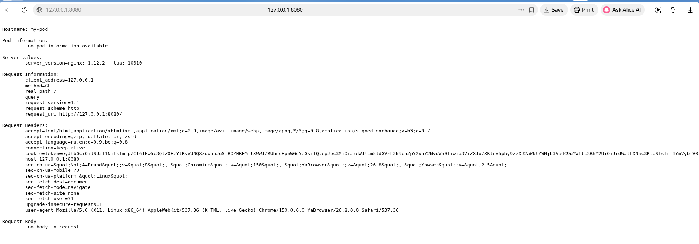
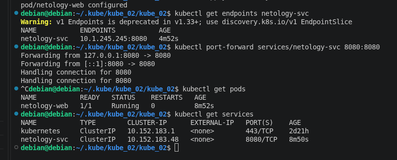
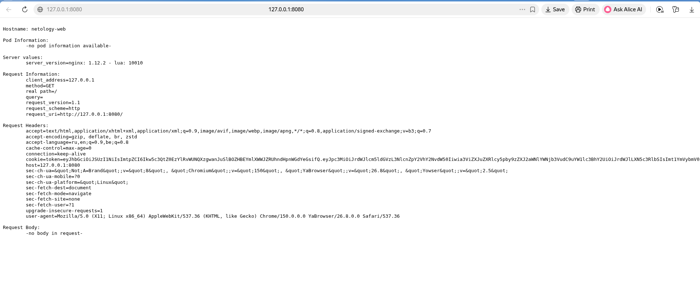

# kube_02
>>Базовые объекты K8S

>>Task-1
[Манифест для Pod](https://github.com/ufilin/kube_02/blob/main/first.yaml)

    

>>Task-2
[Манифест для Pod](https://github.com/ufilin/kube_02/blob/main/svc.yaml)

    

    

